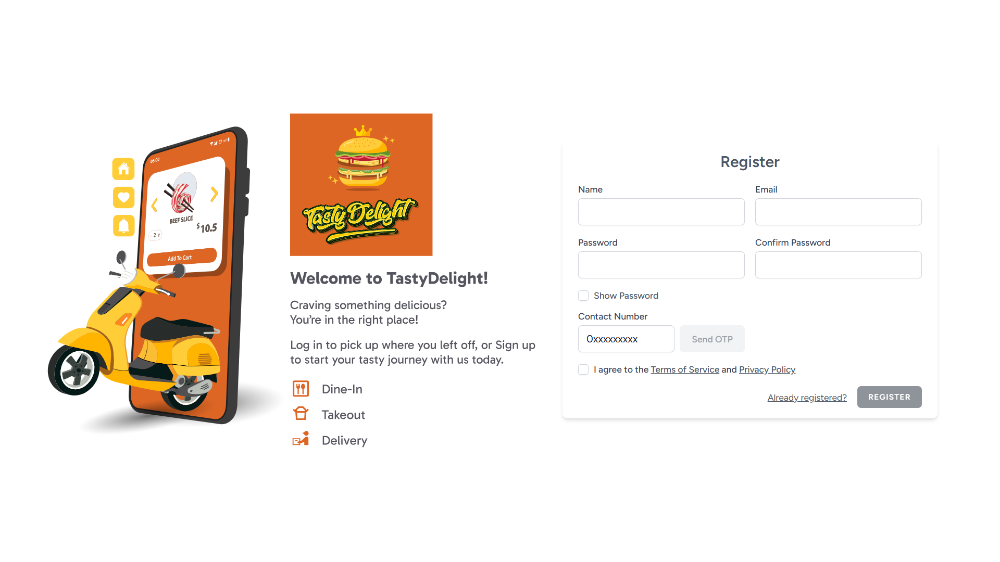

<h1 align="center">TastyDelight E-Commerce Platform</h1>

  A modern, full-stack food delivery and restaurant management platform built with the TALL stack, designed for performance, security, and a seamless user experience.

  

  <strong><a href="https://tastydelight.shop">View Live Demo</a></strong>

---

## 🚀 Tech Stack

- **Framework:** Laravel (TALL Stack - Tailwind CSS, Alpine.js, Laravel, Livewire)
- **Admin Panel:** Filament PHP
- **Database:** MySQL
- **Payments:** Stripe API
- **Emails & OTP:** Resend API
- **DevOps & Hosting:** DigitalOcean, Coolify (Docker)
- **Backups:** Cloudflare R2 (S3-compatible)

## ✨ Key Features

- **Custom OTP Authentication:** Bypasses traditional email verification by utilizing a secure, 6-digit OTP code delivered instantly via the Resend API during registration.
- **Dynamic Cart & Checkout:** Real-time cart updates powered by Laravel Livewire, securely integrated with Stripe's Payment Element for frictionless checkout.
- **Filament Admin Dashboard:** A beautiful, responsive backend portal for restaurant managers to seamlessly handle orders, track revenue, and manage the product catalog.
- **Optimized UI/UX:** Fully responsive, accessible, and designed with Tailwind CSS, featuring smooth transitions and micro-animations for a premium feel.

## 🏗️ Production Architecture

This application is deployed using a modern, enterprise-grade cloud architecture:
- **Zero-Downtime Deployments:** Managed by **Coolify**, which watches the GitHub repository and automatically builds, optimizes (`php artisan optimize`), and swaps Docker containers seamlessly on a **DigitalOcean** Droplet.
- **Persistent Asset Storage:** User-uploaded assets (like product images) bypass ephemeral containers using Coolify's Persistent Volumes, directly mapping to the DigitalOcean server's hard drive.
- **Automated Off-site Backups:** Coolify automatically dumps the live MySQL database and securely ships it to **Cloudflare R2** on a scheduled cron job, protected by a 30-day lifecycle deletion rule.
- **Secure Networking:** Fully automated Let's Encrypt SSL generation for `tastydelight.shop`.

---
*Developed by Razman Farook*
